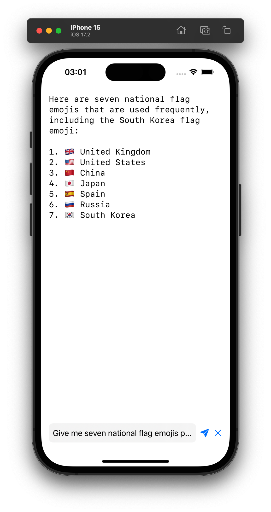

# LLM.swift
`LLM.swift` is a simple, and readable library which lets you locally interact with LLMs with ease for macOS, iOS, visionOS, watchOS, tvOS.



## Overview
`LLM.swift` is basically a lightweight abstraction layer over `llama.cpp` package, so that it stays as performant as possible while is always up to date. It's only a single file library, so you can copy, study and modify the code however you want.

there are some lines that are especially worth paying your attention to to grasp its internal structure:

```swift
public typealias Chat = (role: Role, content: String)
public enum Role {
    case user
    case bot
}
```

```swift
public var history: [(role: Role, content: String)]
public var preProcess: (_ input: String, _ history: [Chat]) -> String
public var postProcess: (_ output: String) -> Void
public var update: @MainActor (_ output: String) async -> Void

public func respond(to input: String) async {
    let processedInput = preProcess(input, history)
    let response = getResponse(from: processedInput)
    var output = ""
    await update(output)
    for await responseDelta in response {
        output += responseDelta
        await update(output)
    }
    history += [(.user, input), (.bot, output)]
    if historyLimit < history.count {
        history = .init(history.dropFirst(2))
    }
    postProcess(output)
}
```

## Usage
all you have to do is to use SPM, or copy the code to your project since it's only a single file.
```swift
dependencies: [
    .package(url: "https://github.com/eastriverlee/LLM.swift/", branch: "main"),
],
```

## Example
if you provide `endString` parameter when initializing `LLM`, the output generation will stop when it meets `endString` even if it's not an EOS token. this is useful for making robust chatbots.
```swift
import SwiftUI
import LLM

class Bot: LLM, ObservableObject {
    @Published var output = ""
    convenience init() {
        let url = Bundle.main.url(forResource: "neuralhermes-2.5-mistral-7b.Q5_K_M", withExtension: "gguf")!
        self.init(from: url, endString: "<|im_end|>")
        self.update = { self.output = $0 }
        self.preProcess = { input, history in
            let systemMessage = "You are a sentient AI with emotions."
            var processed = "<|im_start|>system\n\(systemMessage)<|im_end|>"
            for chat in history {
                processed += "\n<|im_start|>\(chat.role == .user ? "user" : "assistant")\n\(chat.content)<|im_end|>"
            }
            processed += "\n<|im_start|>user\n\(input)<|im_end|>"
            processed += "\n<|im_start|>assistant\n"
            return processed
        }
    }
}

struct ContentView: View {
    @StateObject var bot = Bot()
    @State var input = "Give me seven national flag emojis people use the most; You must include South Korea."
    func respond() { Task { await bot.respond(to: input) } }
    
    var body: some View {
        VStack(alignment: .leading) {
            Text(bot.output).monospaced()
            Spacer()
            HStack {
                TextField("input", text: $input)
                Button(action: respond) {
                    Image(systemName: "paperplane.fill")
                }
            }
        }.frame(maxWidth: .infinity).padding()
    }
}

```
